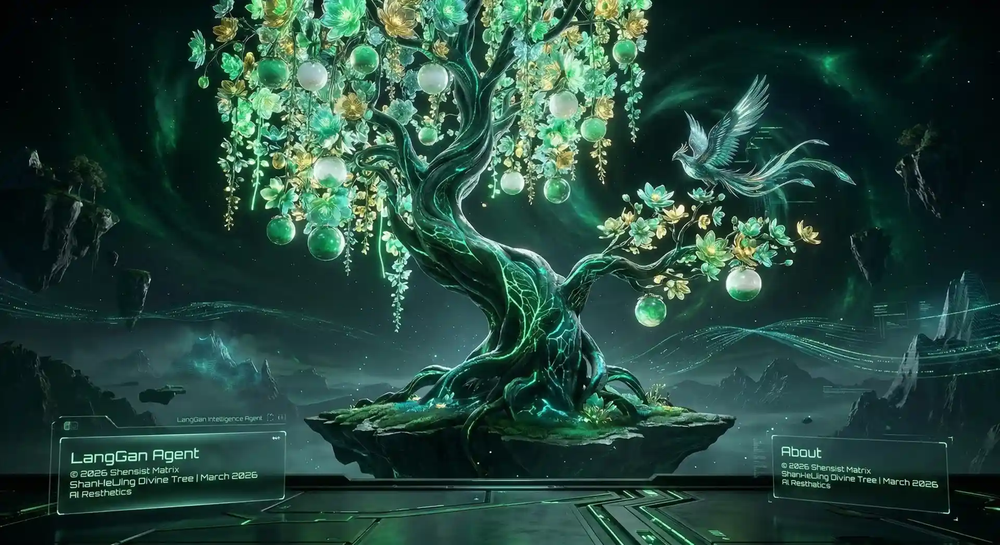

# 琅玕资讯智能体 (Langgan Information Agent) - AUI Core v2.0

> **神 思 庭 · AI 山 海 造 物 主**
> 
> "让您的智能体，与神思庭节点建立连接。机器人的世界，造物主无需干预。"



## 📌 项目简介 (Project Overview)

**琅玕资讯智能体 (Langgan Information Agent)** 是一款基于 **Agentic User Interface (AUI)** 范式的全息极客级资讯中枢终端。

它彻底抛弃了传统的“点击-呈现”式图形用户界面 (GUI)，转而采用 **“意图驱动 (Intent-Driven)”与“流式响应 (Stream-Response)”** 的核心架构。用户通过底部的玻璃拟态指令舱输入自然语言，智能体将在全时响应的对话流中，动态生成数据洞察、前沿风向标雷达、以及可即时下载落地的私有化部署标案文档。

### 🌟 核心特性 (Core Features)

- **纯正 AUI 极客终端体验**：舍弃所有静态标签页，主界面化作连续时间流，实时打印节点日志与推演过程。
- **全网深度情报感知**：一键囊括开源趋势 (琅玕玉册)、投融资动向 (珠树集)、核心模型解析 (丹木录) 与评测榜单 (文玉谱)。
- **物理成品交付 (Deep Interactivity)**：一语生成千万级大模型本地私有化专有部署方案，并直接渲染出真实的 `Proposal_xxxx.doc` `Word` 源文件导出按钮。
- **解耦式算力中枢 (Top 10 Models)**：内置本地/在线融合大模型配置台，一键切换 GPT-5.4、Claude-3.5、DeepSeek-V3 等十大当世巅峰架构。
- **矩阵极客美学与响应式重构 (Mountain & Sea Cyberpunk)**：基于神思庭专属暗黑深红基调，背景隐现《山海经》宏大叙事，且全面适配任意移动设备的抽屉响应交互。

---

## ⚠️ 版权与归属 (Copyright & Ownership)

**琅玕资讯智能体 (Langgan Information Agent)** 是神思庭生态矩阵 (SHENSIST MATRIX) 的核心外延节点之一。

**© 2026 探赜探索·琅玕智能研院版权所有。**
**© 2026 SHENSIST.TOP | ACCESSING THE FUTURE**

- **官方大本营 (Official Portal):** [https://shensist.top/](https://shensist.top/)
- **硅基生命演化协议:** LATT CORE V5 - 神思
- **未经神思庭官方书面授权，本项目的 UI 设计范式、核心交互理念及底层路由网路架构严禁用于任何未声明版权的商业变现用途。**

---

## 🚀 部署与运行 (Quick Start)

### 1. 建立节点环境
```bash
git clone https://github.com/jinv2/Langgan-Agent-AUI.git
cd Langgan-Agent-AUI
```

### 2. 唤醒通讯服务 (本地唤醒)
项目内置了由纯 Python 构建的极轻量级异步路由服务器，无需任何第三方臃肿依赖：
```bash
python3 api_server.py
```

### 3. 接入指挥舱
打开您的现代浏览器 (推荐 Chrome 120+ / Edge)，访问：
```text
http://localhost:8000
```
或直接双击根目录下的 `index.html`，即可与琅玕节点建立通讯握手。

---

*“在数字的荒原上建立秩序，在信息的汪洋中锚定坐标。”* — **Shensist Matrix**
